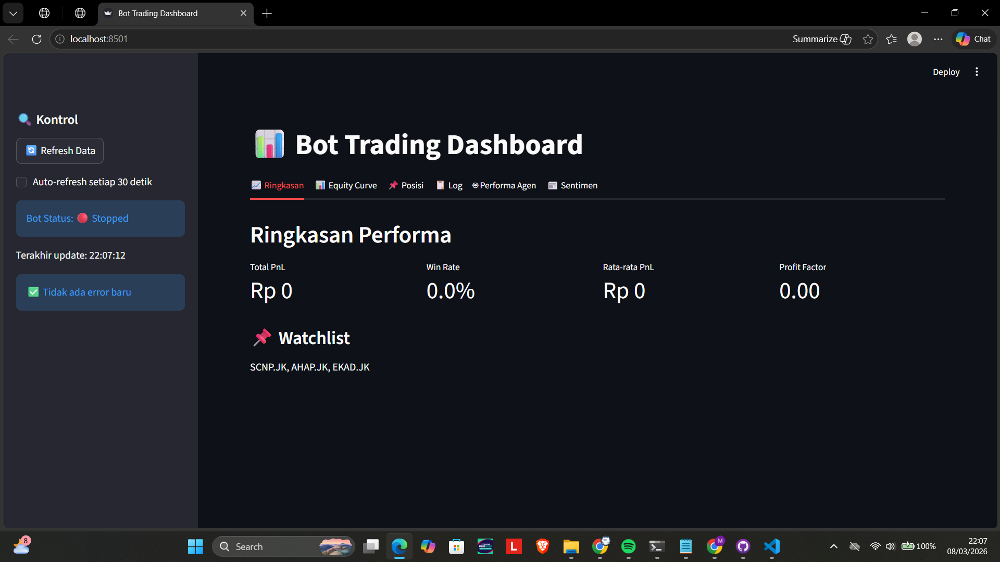
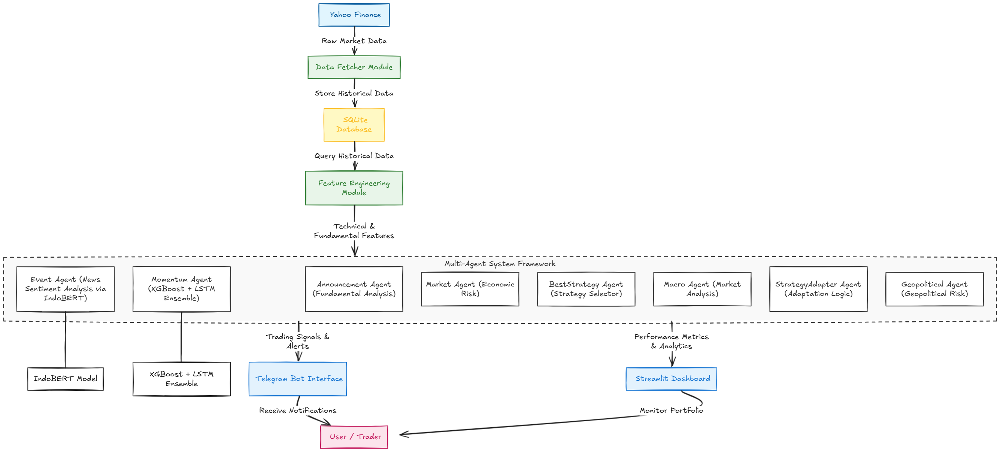

# 🤖 Indonesia Stock Trading Bot

**Multi-Agent Intelligent Trading Bot for Indonesian Stocks**  
Ditenagai oleh XGBoost, LightGBM, LSTM, dan integrasi Telegram. Bot ini mampu menganalisis lebih dari 650 saham Indonesia, memberikan sinyal trading berbasis konsensus 8 agen, dan dapat dilatih secara otomatis.

  
*Contoh tampilan dashboard interaktif*

---

## 📌 Fitur Utama

- **Multi-Agent System** dengan 8 agen khusus:  
  `Announcement`, `Event`, `Momentum`, `Market`, `BestStrategy`, `Macro`, `StrategyAdapter`, `Geopolitical`.
- **Model Machine Learning Canggih**:  
  XGBoost, LightGBM, dan LSTM dengan hyperparameter tuning, ensemble, dan auto-training via antrean.
- **Analisis Sentimen**:  
  Google News + scraping berita lokal (Kontan, IDX Channel, CNBC, Bisnis.com) menggunakan model **IndoBERT** (Bahasa Indonesia).
- **Data Real-time & Historis**:  
  Mengambil data dari Yahoo Finance untuk 650+ saham Indonesia (kode `.JK`), dengan caching dan optimasi database.
- **Manajemen Risiko**:  
  Position sizing berbasis ATR, circuit breaker, cooldown period, dan trailing stop.
- **Bot Telegram Interaktif**:  
  40+ perintah untuk analisis cepat, watchlist, backtesting, jurnal trading, dan monitoring.
- **Dashboard Visual**:  
  Dibangun dengan Streamlit, menampilkan equity curve, performa agen, log error, dan sentimen berita secara real-time.
- **Sistem Antrean Training**:  
  Training model berjalan di latar belakang dengan maksimal 2 proses simultan, mencegah overload bot.
- **Database Terindeks**:  
  SQLite dengan indeks optimal untuk query cepat (rata-rata <0,01 detik untuk 658 ribu baris data).

---

## 🏗️ Arsitektur Sistem

  
*Gambaran alur data dari pengambilan hingga output ke pengguna*

**Penjelasan alur**:
1. **Data Fetcher** mengambil data historis dari Yahoo Finance dan menyimpannya di SQLite.
2. **Feature Engineering** menghasilkan indikator teknikal (RSI, MACD, EMA, ATR, ADX, Ichimoku, Fibonacci, dll.).
3. **Multi-Agent System** terdiri dari 8 agen yang masing-masing memberikan probabilitas naik/turun.
4. **RL Orchestrator** menggabungkan sinyal dengan bobot adaptif (Q‑learning).
5. **Training Queue** mengelola pelatihan model di latar belakang saat diperlukan.
6. **Telegram Bot** dan **Dashboard** menyajikan hasil analisis kepada pengguna.

---

## 🛠️ Teknologi yang Digunakan

- **Python 3.11** – Bahasa pemrograman utama.
- **Pandas, NumPy** – Manipulasi data numerik.
- **yfinance** – Pengambilan data saham dari Yahoo Finance.
- **XGBoost, LightGBM** – Model gradient boosting.
- **PyTorch** – Implementasi LSTM dan IndoBERT.
- **scikit-learn** – Preprocessing dan evaluasi model.
- **Transformers (HuggingFace)** – Model IndoBERT untuk sentimen.
- **TA (Technical Analysis Library)** – Indikator teknikal.
- **Streamlit** – Dashboard interaktif.
- **python-telegram-bot** – Integrasi dengan Telegram.
- **BeautifulSoup, requests** – Web scraping berita lokal.
- **SQLite** – Database lokal.
- **APScheduler** – Penjadwalan tugas otomatis.
- **dotenv** – Manajemen konfigurasi rahasia.

---

## 🚀 Instalasi

### Prasyarat
- Python 3.11 atau lebih baru
- Git
- Token Bot Telegram (dari [@BotFather](https://t.me/botfather))
- (Opsional) API key NewsAPI untuk berita global

### Langkah-langkah

1. **Clone repositori**
   ```bash
   git clone https://github.com/MxCelll/indonesia-stock-trading-bot.git
   cd indonesia-stock-trading-bot

2. Buat virtual environment (disarankan)
python -m venv venv
# Windows
venv\Scripts\activate
# Linux/Mac
source venv/bin/activate

3. Install dependencies
pip install -r requirements.txt

4. Buat file .env berisi kredensial:
env
TELEGRAM_TOKEN=your_telegram_bot_token
TELEGRAM_CHAT_ID=your_telegram_chat_id
NEWS_API_KEY=your_newsapi_key      # opsional
FRED_API_KEY=your_fred_api_key     # opsional

5. Inisialisasi database
python import_symbols.py            # mengimpor 950+ simbol saham
python scripts/optimize_db.py       # menambahkan indeks

6. Jalankan bot
python main.py

7. (Opsional) Jalankan dashboard
streamlit run dashboard.py
Akses dashboard di http://localhost:8501.

📱 Perintah Telegram
Berikut adalah beberapa perintah utama yang tersedia. Untuk daftar lengkap, kirim /help ke bot Anda.

Perintah	Deskripsi
/start	Menyapa dan menampilkan informasi dasar.
/help	Menampilkan daftar semua perintah.
/jelas <kode>	Analisis cepat (harga, RSI, EMA, support/resistance).
/agent <kode>	Analisis multi-agent lengkap dengan auto‑training.
/top	Menampilkan saham dengan gain/loss terbesar hari ini.
/screener [filter]	Mencari saham berdasarkan kondisi teknikal (oversold, volume spike, golden cross, dll).
/tf <kode>	Analisis multi‑timeframe (daily, weekly, monthly).
/backtest <kode>	Menjalankan backtesting sederhana.
/journal	Ringkasan jurnal trading.
/train_status	Status antrean training model.
/errors	Menampilkan error terbaru dari log.
/update_fundamental	Memperbarui data fundamental semua saham.

📊 Contoh Output
Perintah /agent BBCA:

🤖 *Multi-Agent Analysis BBCA.JK*
Regime: trending_bull

• Announcement: BUY (conf 40.0%, reason: PER moderat (15.4x) [+10]; PBV tinggi)
• Event: SELL (conf 0.0%, reason: News: -0.07, Cluster: 0.00)
• Momentum: BUY (conf 92.3%, reason: Ensemble: NAIK (92.3%))
• Market: BUY (conf 60.0%, reason: Economic risk: LOW)
• BestStrategy: BUY (conf 70.0%, reason: Entry signal from best strategy)
• Macro: BUY (conf 30.0%, reason: Macro: Sektor terkuat terdeteksi (+5))
• StrategyAdapter: SELL (conf 0.0%, reason: Volatilitas tinggi, gunakan Goren)
• Geopolitical: BUY (conf 46.0%, reason: SEDANG (skor 0.46))

*Konsensus:* NETRAL (conf 50.0%)
Dashboard Interaktif (Streamlit):
https://assets/dashboard.png

🗂️ Struktur Proyek
.
├── main.py                     # Entry point bot (scheduler)
├── dashboard.py                # Streamlit dashboard
├── requirements.txt            # Dependencies
├── .gitignore                  # File yang diabaikan Git
├── .env                        # Konfigurasi rahasia (tidak di-commit)
├── scripts/                    # Semua modul Python
│   ├── data_utils.py           # Fungsi database dan indikator
│   ├── historical_yahoo.py     # Pengambilan data Yahoo Finance
│   ├── sentiment_news.py       # Scraping berita & sentimen
│   ├── lstm_predictor.py       # Model LSTM
│   ├── ensemble_predictor.py   # Ensemble XGBoost + LightGBM
│   ├── training_queue.py       # Antrean training background
│   ├── agent_analyst_framework.py  # Definisi 8 agen
│   ├── multi_agent_selector.py # RL orchestrator
│   ├── risk_manager.py         # Manajemen risiko
│   └── ... (modul lainnya)
├── services/                   # Layanan eksternal (Stockbit, dll)
├── utils/                      # Fungsi pembantu
├── data/                       # Database, cache, model (diabaikan Git)
│   ├── saham.db                # Database SQLite
│   ├── cache/                  # Cache sentimen
│   └── lstm_models/            # Model LSTM yang sudah dilatih
└── assets/                     # Gambar untuk README

📝 Lisensi
Proyek ini dilisensikan di bawah MIT License – lihat file LICENSE untuk detail.

⚠️ Disclaimer
Bot ini dibuat untuk tujuan edukasi dan riset.
Trading saham mengandung risiko tinggi. Penulis tidak bertanggung jawab atas kerugian finansial yang mungkin timbul akibat penggunaan bot ini. Selalu konsultasikan dengan penasihat keuangan sebelum mengambil keputusan investasi.

👤 Penulis
- MxCelll
- GitHub: @MxCelll
- LinkedIn: https://www.linkedin.com/in/muhammad-excel-trisnaro-55895737a?utm_source=share_via&utm_content=profile&utm_medium=member_ios

🙏 Acknowledgements
- Terima kasih kepada komunitas open source atas library‑library luar biasa seperti yfinance, ta, transformers, xgboost, lightgbm, torch, dan python-telegram-bot.
- Terinspirasi dari proyek Saftrade dan Freqtrade.

⭐ Jika proyek ini bermanfaat, beri bintang di GitHub!